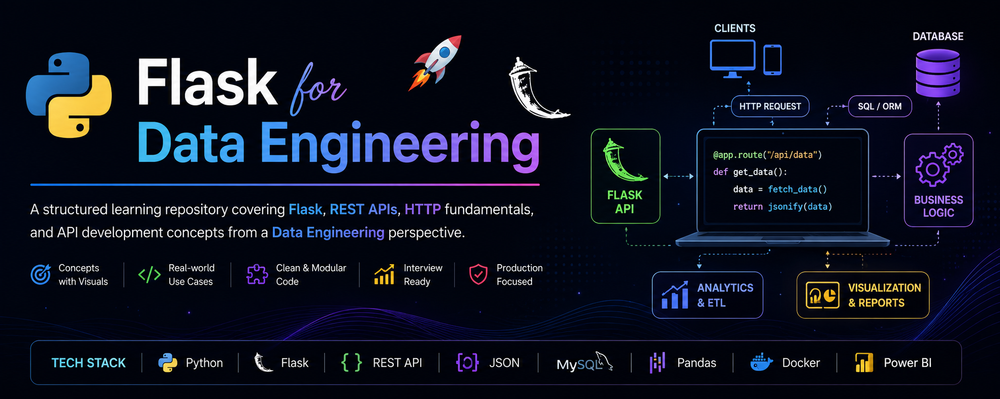
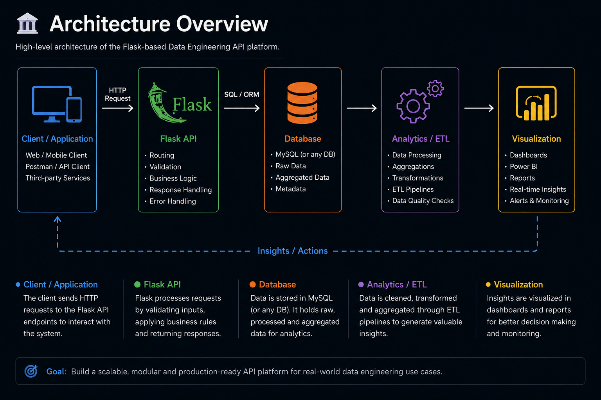
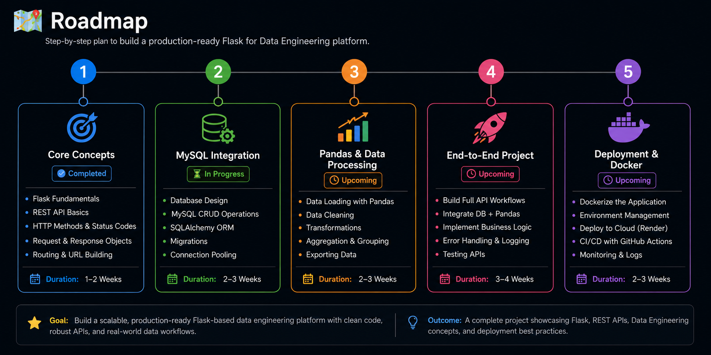

<p align="center">
  
</p>

<div align="center">

# Flask for Data Engineering 🚀

### A structured learning repository covering Flask, REST APIs, HTTP fundamentals, and API development concepts from a Data Engineering perspective.

<br>


</div>

---

<table>
<tr>

<td width="70%">

# 📌 Table of Contents

| 🚀 Explore            | 🧠 Learn             | 🗂️ More              |
| --------------------- | -------------------- | --------------------- |
| About This Repository | Request Flow         | Diagrams              |
| Learning Outcomes     | Key Concepts         | Interview Preparation |
| Architecture Overview | Technology Stack     | Roadmap               |
| Topics Covered        | How to Use This Repo | Contributing          |
| Repository Structure  | Example Code         | Connect With Me       |

</td>

<td width="30%">

## ✨ Highlights

✅ Concepts explained with visuals

✅ Real-world Data Engineering use cases

✅ Clean and modular code examples

✅ Interview questions with answers

✅ Project-ready structure

</td>

</tr>
</table>

---

<table>
<tr>

<td width="65%">

# 📖 About This Repository

This repository is my structured learning journey into Flask and REST API development from a Data Engineering perspective.

It contains:

* Concept notes
* Code examples
* Architecture diagrams
* API fundamentals
* Interview preparation materials
* End-to-end project implementation

> 💡 Well documented today, production ready tomorrow.

</td>

<td width="35%">

## 🛠️ Tech Stack

🐍 Python

🌶️ Flask

🔄 REST API

📦 JSON

🗄️ MySQL *(coming in project)*

🐼 Pandas *(coming in project)*

🐳 Docker *(coming in project)*

📊 Power BI *(coming in project)*

</td>

</tr>
</table>

---

# 🏛️ Architecture Overview

<p align="center">
  
</p>

---

# 🔄 Request Flow

<p align="center">
  
</p>

---

# 📚 Topics Covered

<table>
<tr>

<td width="20%">

### 01

**Why APIs Exist**

Understand the need for APIs in modern systems.

</td>

<td width="20%">

### 02

**API vs REST vs Flask**

Clear difference between API, REST API and Flask.

</td>

<td width="20%">

### 03

**Flask Application Object**

Understanding:

`app = Flask(__name__)`

</td>

<td width="20%">

### 04

**Routing & Decorators**

How routes map URLs to Python functions.

</td>

<td width="20%">

### 05

**HTTP Methods**

GET, POST, PUT, DELETE explained with examples.

</td>

</tr>

<tr>

<td>

### 06

**Request Object**

`request.args`

`request.json`

Headers and more.

</td>

<td>

### 07

**Dynamic Routes**

`<int:id>` and route converters.

</td>

<td>

### 08

**JSON Responses**

Returning data in JSON format.

</td>

<td>

### 09

**HTTP Status Codes**

200, 201, 400, 404, 500 and best practices.

</td>

<td>

### 🚀 Project

**Real-Time Event Analytics Platform**

Built using Flask and Data Engineering concepts.

</td>

</tr>
</table>

---

# 🗺️ Roadmap

<p align="center">
  
</p>

---

# 📂 Repository Structure

```text
flask-for-data-engineering/

├── README.md
├── assets/
│   ├── banner.png
│   ├── architecture-overview.png
│   ├── request-flow.png
│   ├── roadmap.png
│   └── event-platform-architecture.png
│
├── docs/
├── examples/
├── interview_questions/
├── notes/
└── project/
```

---

# 🚀 End Goal Project

## Real-Time Event Analytics Platform

<p align="center">
  
</p>

### Key Features

* Event Ingestion APIs
* User Authentication APIs
* Event Analytics APIs
* Revenue Tracking
* Active User Metrics
* Aggregations
* Dashboard Reporting
* Power BI Integration
* Real-time Monitoring
* Alerting System

---

# 💼 Interview Preparation

This repository also serves as an interview preparation resource covering:

* Flask Fundamentals
* REST API Design
* HTTP Protocol
* JSON Handling
* Database Integration
* ETL API Design
* Production Architecture
* System Design Concepts
* End-to-End Project Discussions

---

# 🤝 Connect With Me

💼 LinkedIn: https://www.linkedin.com/in/aniket-dev/

📧 Email: [anikettrivedi.work@gmail.com](mailto:anikettrivedi.work@gmail.com)

🐙 GitHub: https://github.com/anikettrivedii

𝕏 X: https://x.com/Aniket_Trivedi_

📍 Delhi-NCR, India

---

<div align="center">

### ⭐ If you find this repository useful, consider giving it a star.

### Learn → Document → Build → Explain → Ship 🚀

</div>
